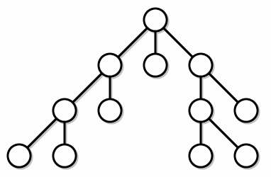
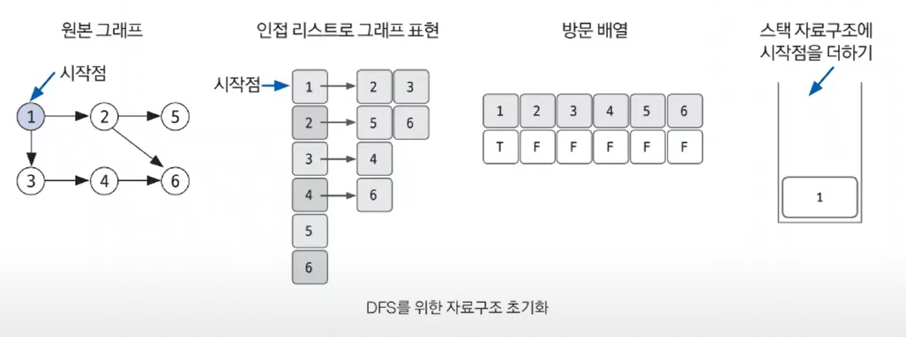
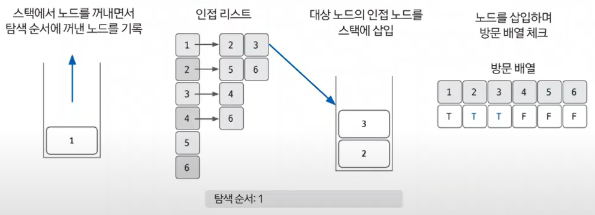
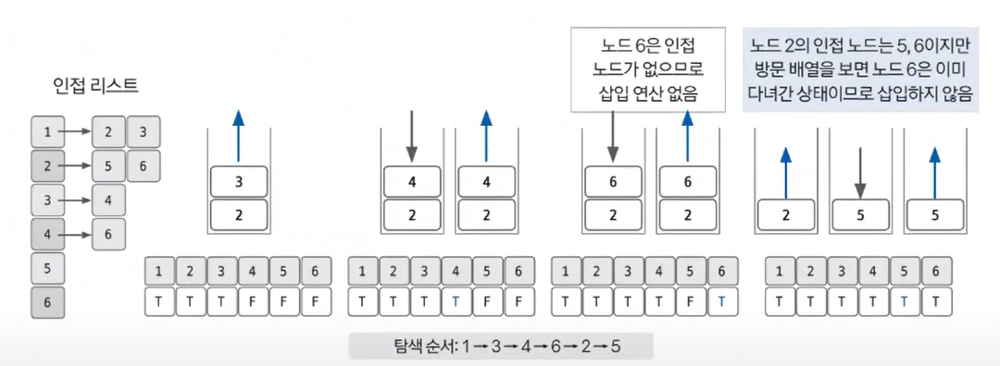
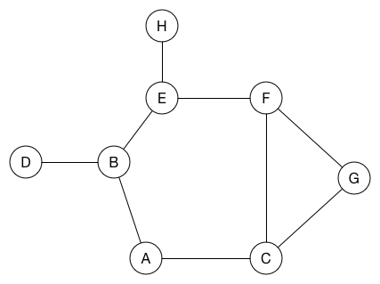
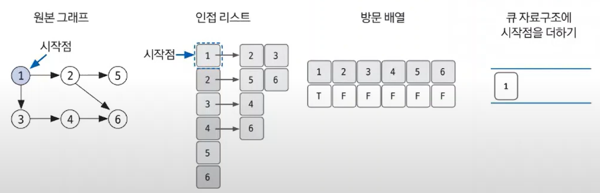
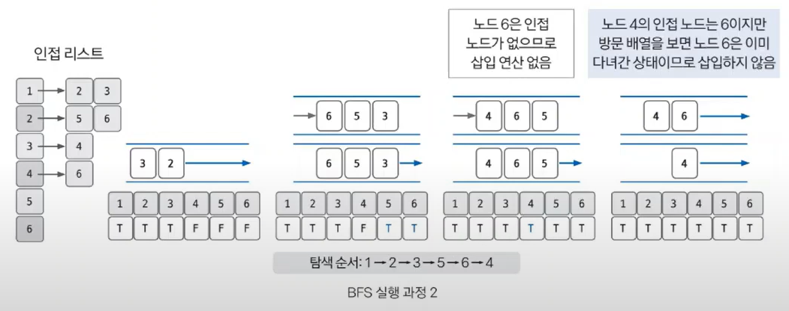

# DFS (깊이 우선 탐색)


### 개념

---


- 시작 노드에서 출발하여 탐색할 한 쪽 분기를 정하여 끝까지 탐색을 마친 후
- 다른 쪽 분기로 이동하여 다시 탐색을 수행


### 구현을 위해 필요한 요소

---
1. List : `2차원 배열`로 그래프의 인접 노드를 표현
2. 노드 방문 여부를 체크할 `배열`
3. 현재 탐색 상태를 저장할 `Stack` or `재귀 함수`



### 구현 방식

---
1. 재귀 함수로 구현 (코테에선 이걸 주로 사용)
```java
private static void DFS(int v) {
    visited[v] = true; // 현재 노드를 방문한 것으로 표시
    System.out.print(v + " "); // 방문한 노드 출력
    for(int i : graph[v]){
        if(!visited[i]) DFS(i);
    }
}
```
2. 스택 자료구조 이용
```java
private static void dfs(int startNode) {
        Stack<Integer> stack = new Stack<>();
        stack.push(startNode);
        visited[startNode] = true; // 시작 노드를 방문했다고 표시

        while (!stack.isEmpty()) {
        int node = stack.pop();
        System.out.print(node + " "); // 방문한 노드 출력

        // 인접 노드를 스택에 추가 (방문하지 않은 노드만 추가)
        for (int neighbor : graph[node]) {
        if (!visited[neighbor]) {
        visited[neighbor] = true; // 인접 노드를 방문했다고 표시
        stack.push(neighbor);
        }
      }
   }
}               
```

### 구현

---
1. DFS를 시작할 노드 정하고, 자료구조 초기화 하기
2. 스택에서 노드를 꺼낸 후, 꺼낸 노드의 인접 노드를 다시 스택에 삽입
3. 스택 자료구조에 값이 없을 때까지 반복

- 이미지 설명



- 스택에서 꺼내면서 `탐색 순서` 결정
- 스택에 넣으면서 `노드 방문 여부` T로 설정


# BFS (너비 우선 탐색)

### 개념

---

- 시작 노드를 기준으로 자신과 연결된 모든 정점을 탐색한다.
- 구현에서 DFS랑 스택이냐, 큐이냐 차이만 있음

### 구현을 위해 필요한 요소

---
1. List : `2차원 배열`로 그래프의 인접 노드를 표현
2. 노드 방문 여부를 체크할 `배열`
3. 현재 탐색 상태를 저장할 `Queue`

### 구현 방식

---
1. 주로 큐를 사용
    ```java
    private static void BFS(int Node) { // BFS 구현하기
        Queue<Integer> queue = new LinkedList<>();
        queue.add(Node);
        visited[Node] = true;

        while (!queue.isEmpty()) {
            int now_Node = queue.poll();
            System.out.print(now_Node + " ");
                for (int i : A[now_Node]) {
                    if (!visited[i]) {
                    visited[i] = true;
                    queue.add(i);
                }
            }
        }
    }
    ```

### 구현

---
1. 자료구조 초기화
2. 큐에서 노드를 꺼낸 후, 꺼낸 노드의 인접 노드를 다시 큐에 삽입

- 이미지 설명


