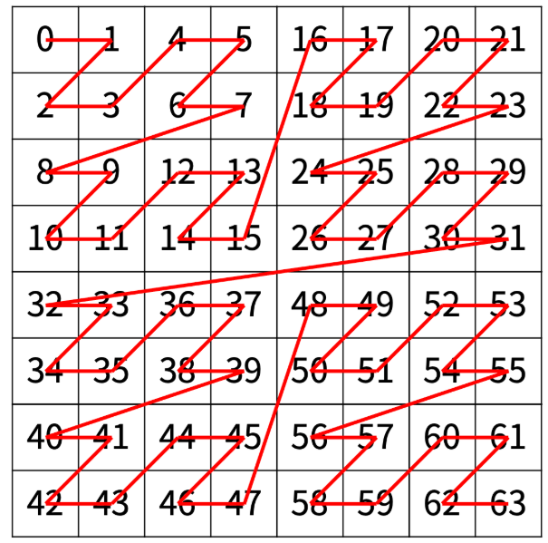

# 재귀  : 함수가 자기 자신을 호출

## 개념 

---

- 함수가 자기 자신을 다시 호출
- 사용 시점 : 하나의 큰 문제를 동일한 구조를 가진 더 작은 문제로 나누어 해결
- 예시 - 백준 1074번 Z : 아래와 같은 경우 (좌상, 우상, 좌하, 우하)로 모든 문제를 나누어 생각 할 수 있음


## 재귀 문제 풀이 STEP

---

1. 함수의 정의 : 함수가 어떤 역할을 수행하는지, 어떤 인자를 받는지 정하기
2. 종료 조건 정의
3. 재귀 식 정의 
- 예시 - 백준 1074번 Z 

1. 함수 정의 
```python
# n은 depth, r,c는 찾아야 할 행,열
def Z (n, r, c) / return "방문 순서"
````` 
2. 종료 조건 정의
```python
if n == 0 return 0
````` 
3. 재귀 식 정의 
```python
# (r, c)가 1번 사각형일 때 
return func(n-1, r, c);
# (r, c)가 2번 사각형일 때 
return half*half + func(n-1, r, c-half);
# (r, c)가 3번 사각형일 때 
return 2*half*half + func(n-1, r-half, c);
# (r, c)가 4번 사각형일 때 
return 3*half*half + func(n-1, r-half, c-half);
````` 

## 풀이 TIP
- 귀납적 사고에 익숙해져 보자
  - ex) 1번 도미노가 쓰러진다 / k번 도미노가 쓰러지면 k+1번 도미노가 쓰러진다.
  - ex) Z에서는 좌상, 우상, 좌하, 우하 를 돈다.
- 모든 입력은 종료 조건으로 수렴해야 한다.
- For문이 무한 depth로 필요할 때 재귀를 떠올리자
- 함수 인자로 어떤걸 받을지, 어디까지 계산하고 다음으로 넘길지 명확하게 정해야한다.
